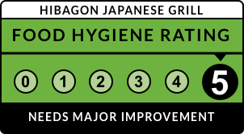
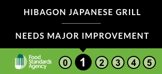
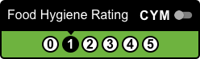
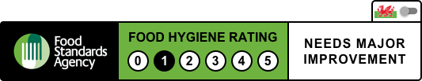
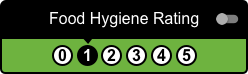
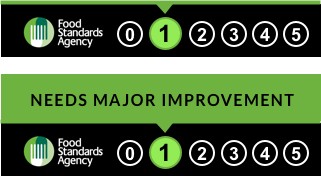
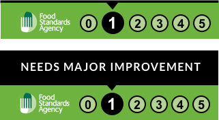
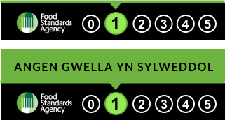
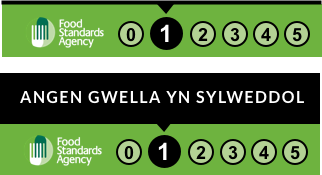
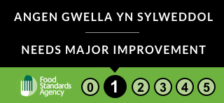

## Exploration and thinking 

There isn’t a ‘one size fits all’ solution and so we must encourage rather than enforce businesses to use digital assets in a way that is acceptable. This is because of the sheer amount of different platforms digital display may need to exist on:

* Web-builders such as Wix / Squarespace / Shopify
* Custom CMS platforms
* Custom eCommerce and fulfilment platforms
* Online ordering systems (Aggregators)
* Online booking systems (Book a table, Open table etc)
* Social media profiles / pages / groups
* Online marketplaces (Etsy / eBay / Facebook market)
* et al.

Because of this, we think allowing businesses to choose an asset which best suits their platform is beneficial.
 
Here, we explore a few options which are in-keeping with brand, context, language requirements, screen sizes and authenticity.

### Examples

**Static assets with business name**

If a user wishes to only post a static asset to their website or social media platform, we felt the business name must be included to give authenticity to the badge - meaning only they can use it. 

Apart from a  simple URL, this is the one asset which could work across all platforms. A simple image upload. 

_Challenges:_
* Chains have a lot of businesses with the same name, so this could potentially confuse users
  * eg Nandos _all_ or Nandos _Sheffield_
* Limitations on space on the badge for dual language on small screens

_Recommendations:_
* Encourage use with added information on page, such as placing with location details for context
* Encourage accompaniment of a live link to open data on FSA website

**Dual language examples**

We were asked to explore the use of _bilingual_ digital badges to serve the Welsh legislation and give businesses the option to show both Welsh and English languages.

_Challenges:_

* Show both Welsh and English language on the same badge
* Show Welsh language first
* Allow businesses to decide if they want bilingual or single language badges
* Lots of information to display on smaller screens

_Recommendations:_

* Compromise and trial the use of a toggle badge, being _dual-language_ not strictly _bilingual_ due to space on small screens and accessibility requirements of font sizing
* Allow businesses to choose if they want Welsh only, English only or Dual-language assets 
* Test the use of iconography (flags) vs Text indicators vs no indicator just a switch

**Banner examples**

Whilst considering the placement of badges, we felt that consumers would be on a curve of awareness when it comes to seeing FHRS digitally. This pushed our thinking to make comparison to recent online policy programs such as Cookie Law, The modern slavery act and GDPR. In most cases, website are allowed to design their own interpretation of how a user is notified of a change in policy. 

_Challenges:_
* Disrupting consumer journeys and buying behaviour
* Lowering the conversion rate of online ordering or booking
* Implementing a banner which shows on any page from which a consumer lands
  * After 'X' seconds dwell time?
  * After 'X' % page scroll?
  * After 'X' pages visited?
* Design could conflict with business' website navigation and branding

_Recommendations:_
* In the early days of legislation, it could be that consumers are fine to see notification style alerts, designed like FHRS badges to raise awareness and engagement
* As consumers become more aware of FHRS, businesses may not need to present them in such a disruptive way
* Allow users to close the notification to drive engagement with it

 

**Small screen examples**

_Challenges:_
* Less real estate to add a lot of information to
* Accessibility means following a minimum font size of 16pt
* Different browser rendering engines
* Different screen sizes in general - no one size fits all, must be scalable
* Adding language toggle or bilingual versions

_Recommendations:_
* A choice of assets from more information to less
* A banner style which can stretch background to tablet size, before becoming a larger screen version

