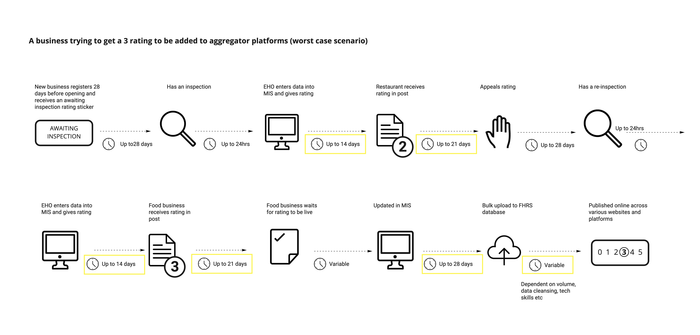

Our work focused on how we might implement a mandatory policy for digital badges. This meant understanding how the existing service currently works, exploring the challenges of digital badges and designing a future service where the new legislation would fit in to the existing system. Our research identified a range of challenges throughout this process, which we have detailed below, with corresponding recommendations.

## Design

### Challenges 
* The badges will conflict with the business branding - how to ensure they aren’t confused / detrimental to each other. 
* Existing consumer research identified that the previous designs were not immediately recognisable as FHRS and therefore didn't mean much to users
* Users also struggled to know what the value of the ratings were. Numbers alone were not enough context - they needed a scale and the associated text to make sense of them.
* Existing designs did not meet accessibility reqirements.
* For Welsh users the badges needed to be available in Welsh/bilingual
* Designing to these criteria creates fairly large badges, which may be challenging to get businesses to integrate into their sites. Aggregate sites expressed that they wouldn't want to display these on results pages.

### Recommendations
* Create responsive designs which work on mobile and desktop as well as other screens.
* Give a range of badges to allow businesses an element of choice
* Give the option of "minimum display" for social media (eg. a static asset)
* Language toggle with switch to allow space for the badges on small screens
* AA accessibility standard
* Test brand recognition
* Create digital brand guidelines

### Implementation/impact

### Challenges 
* Group business owners raised the risk that if implementation was difficult to to, businesses might just opt out of having a website at all (or use other channels) rather than risk fines.
* Commercial impact to businesses needs to be accounted for. Aggregators have set standards already (UberEats at 2 and above, JustEat and Deliveroo at 3 and above). Businesses may still be able to trade on the high street but can't on these platforms. Although standards will ultimately be driven up, there may be a significant commercial impact from mandating display online where user choice is high (they'll just choose somewhere else to eat).
* There is a risk of consumer fatigue - as seen with cookies messaging. At first consumers are engaged, but after time, disregard the message without reading. Time will tell how consumers respond to ratings if mandated everywhere.
* Some websites may not be responsive
* Business websites are built on a wide range of platforms such as web-builders, custom CMS's or custom builds - support and guides will need to account for all of these different user types.
* It will take a long time for news of new policy to be taken on

### Recommendations 
* Provide businesses with a preview tool so they may see how badges interact with their own brand and select best placement based on guidelines
* Add business name to badge if possible to provide an extra layer of security
* Allow for batch export of badges for groups and chains

## Policy

### Challenges
Current system flaws will be highlighted:
* The definition of food business is changing - dark kitchens and virtual brands - policies around these need to be defined and a consistent approach to data/registration/inspection of them
* Enforcement would be extra work for already stretched Local Authorities to deliver
* Interpretation of numbers - lots of context needed. Pass/Fail would be easier to interpret 
* Lots of time lags and inconsistencies in the LA current process will have a knock on effect to businesses

## Technology and data

### Challenges
* Some but not all councils use digital FHRS forms
* Current API is being used but is not 'water-tight' so anyone can use any badge

### Recommendations
* Digitising the ratings application and assessment
* Allowing businesses to manage their own data once registered
* Update legacy API with better security measures and design
* 2 Factor authentication for businesses to securely receive their badges and know that others cannot use their ratings 
* Automated alerts for Local Authorities when businesses fail to display after set period
* Automated reminders for FBOs when they fail to display after set period
* Automated reminders for Local Authorities when FBOs are due inspections
* Automated prioritisation of FBOs who are due inspections based on time since last inspection, appeals or payments for re-rating

## Data quality and governance 

### Challenges
* No standardisation between Management Information Systems at Local Authorities
* There are 3 places to register a food business (are they feeding the same database?)
* There is a lack of governance over data quality and systems
* No UID - fuzziness in identifying food businesses and tracking across systems
* Human mistakes can be made with current manual handling and processing of data
* Many businesses do not know how their data is being handled
* Lack of businesses being able to update their own details
* Lack of resources to clean up data, although in some councils it does happen

### Recommendations
* UID to identify and track businesses (even if changes are made)
* Sync MIS and FHRS databases
* Clean up data and enforce a level of governance to ensure ongoing data quality
* Improve search features
* Define the minimum data that defines a ‘food business’ e.g. Location, name, owner, online presence etc
* Define what elements can be changed and the business is still the same vs need to be re-registered
* Apply added layer of authentication for businesses to manage their data

## Tracking and enforcement

### Challenges
* How to track where badges are being displayed?
* How to automate the checking of placement process? (quality of implementation)
* How to find and associate websites to businesses?
* How to tamper-proof badges?
* How to ensure they are displaying up to date badges?

### Recommendations
* Realtime updated scores 
* Two factor authentication to access badges associated with registered business
* Implement referrer header of requests to the API so that each call to the database is referenced in the URL - this allows users to easily see that the badge is the correct business reference where no business name is in the badge itself
* Tracking of IP addresses to analyse location of badge being used, alerts when outside of the UK
* Tracking of impressions on each badge, alerting when there is a spike in traffic (eg a duplicate badge is being used and starts to see double or more impressions)
* Use a CDN to cache responses for delivering multiple badge options to businesses such as design, format / size or static assets

## Onboarding and support

### Challenges
* How will bug reporting/patches/updates be managed?
* User capability/need levels differ
* Who will deliver support?
* Who will create guidelines for array of web platforms needed?

### Recommendations
* Language variable - Welsh/English
* Allow choice of assets for different users
* Visual
* Unicode
* Embed etc
* Offer instructions guides/onboarding for a wide range of platforms and user type
* FSA will need to offer a support team and BAU team to support the project

