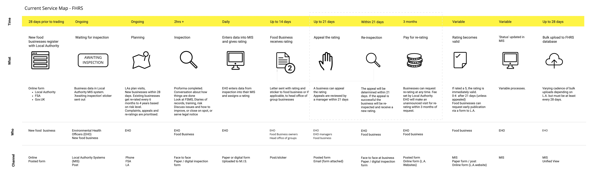

## Current Service Experience Map
This map illustrates the current end-to-end experience of the FHRS service. It highlights the range of users involved, what happens at each stage, the channels used and the timeframes associated to each stage.

To enlarge either right click and open in a new tab or you can open this PDF

[Current Service Map](uploads/Current_Service.pdf)

