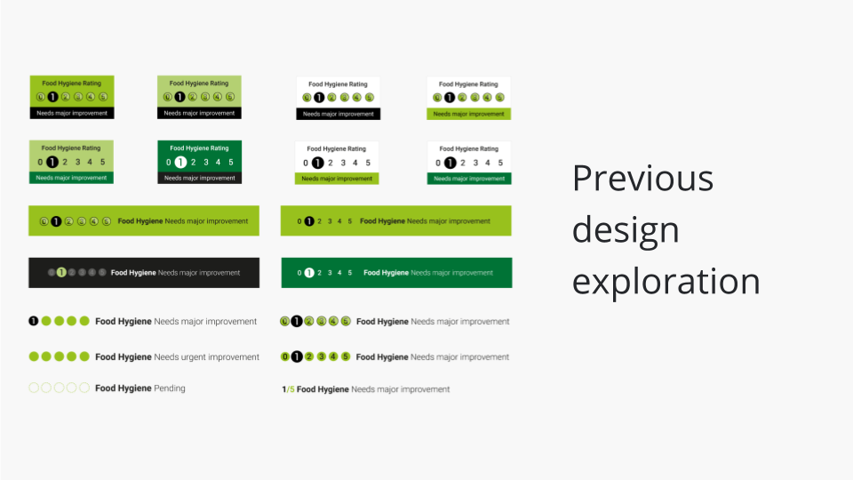
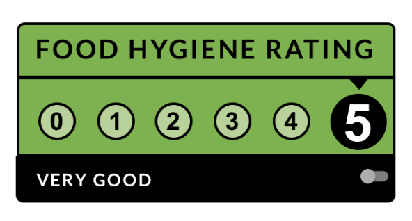
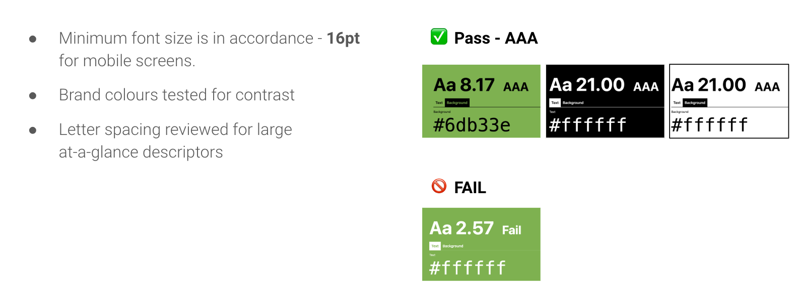
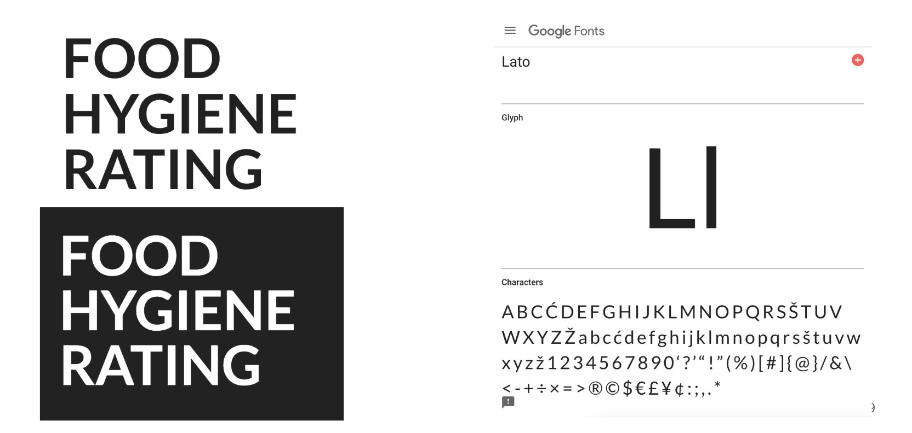
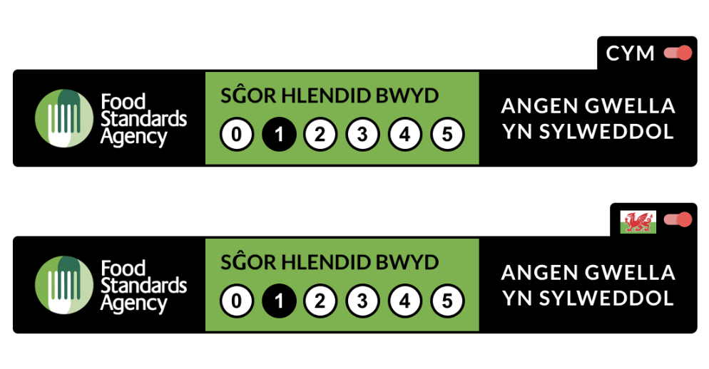
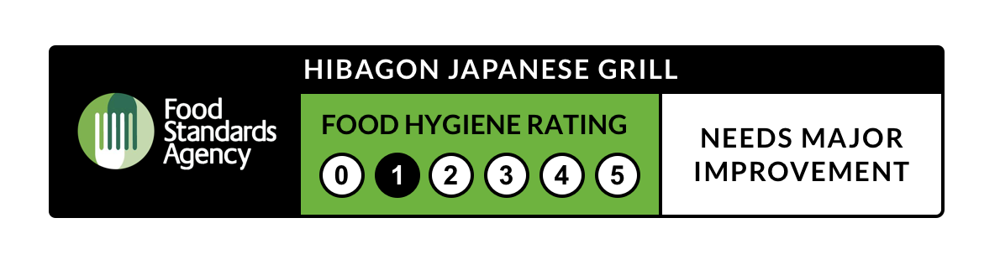

## Previous work

### Challenges
* Brand not recognised in the initial set of design
  * Inconsistent colouring (incorrect green)
  * Inconsistent font
  * No use of FSA logo (although queried if this is important)
* Queried incompatibility with small screens
* Placement for different business types is difficult to define
* Accessibility questioned, however previous work does allude to following accessibility guidelines to AA standard
* No language options due to work being solely commissioned by Northern Ireland team

## New Work

### Brand recognition + context
* Appropriate green used
* Addition of black border as associated with physical badge design
* In some options, addition of the FSA logo for context and trust
* Rating descriptors added
* Options for use of 'Food Hygiene' vs 'Hygiene Rating' used as titling

### Accessibility
* Size 16 pt font size used on smallest options for legibility on mobile screens
* Tested brand colour combinations for pass / fail status as seen below 
* Updated unicode options
* Open font selected for use instead of custom logo-font
* True bilingual (Welsh shown alongside English) is too much information to fit within a small screen badge size and remain legible or useful

### New open font
* Lato open web font selected for testing
* Full character sets available
* Free and renders in majority of browser types 
* Resembles the FHRS logo-font which is a custom design but not accessible
* License available for free here: <https://fonts.google.com/specimen/Lato>

### Language options
* Exploration of a language toggle on badges to serve dual language display
  * Welsh / Union Jack flag option without text descriptor - less accessibility friendly unless embedding alt-text to icon, but more recognisable
  * Simple toggle-switch function with text descriptor - less recognisable as to what the toggle does and 'CYM' only makes sense to Welsh speakers

### Additional thinking
The learning curve of consumers will change over time, some learnings could be taken from other policy implementation over recent past such as cookie law, GDPR or The Modern Slavery Act. As a research group, we found that awareness is key for both businesses and consumers and any decision for digital display must be accompanied by a through-the-line campaign for awareness over a structured period of time. For example a framework such as "seeding, awareness, engagement and reaction" could work well to drive up engagement with digital ratings and negate the need for disruptive assets. 
* Initially, without broad consumer and business awareness, options for display could take the forms of notifications such as banners or modal pop-ups which the user has to interact with to continue to order or purchase food or book a reservation - like cookie notifications
* Challenges to this are these methods disrupt the user's journey and ultimately damages the conversion rate of businesses until consumers intrinsically look for ratings as part of their journey as opposed to disruptive notices
* Spearheading larger reaching businesses such as aggregators, to use ratings as part of their taxonomy (such as in filters or search features) would widen the awareness of consumers without disrupting their journey and harming conversion rates
* At very least, businesses can add a basic URL link to their site, which is accessible and takes a user to the FSA website, negating the need for responsive design assets and implementation
* Potential to include business name as an extra precautionary measure to tamper-proofing the badges:

