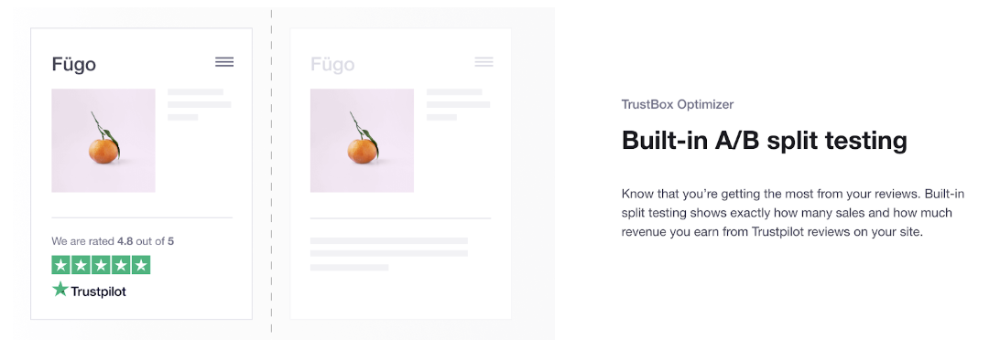
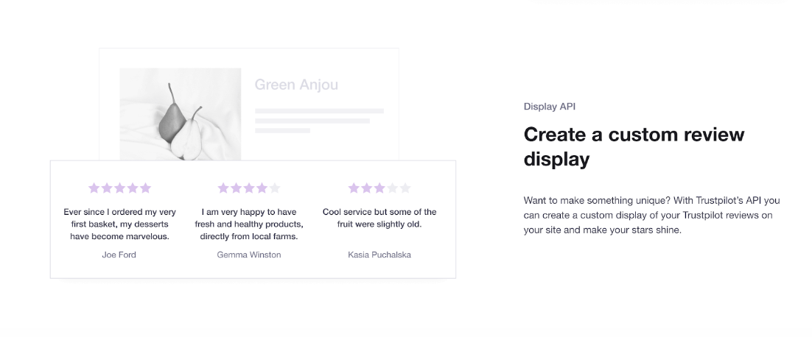
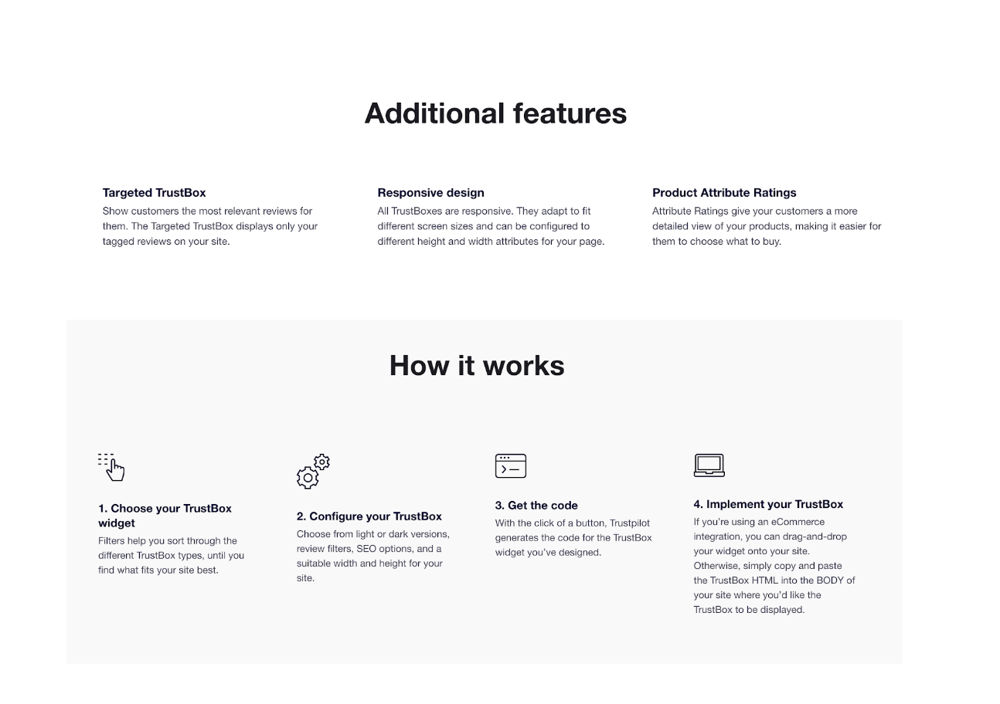
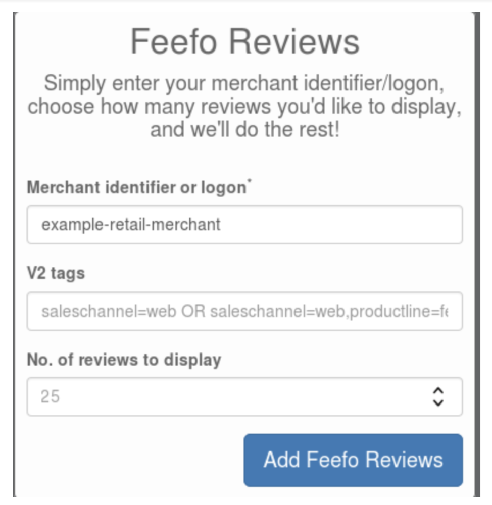
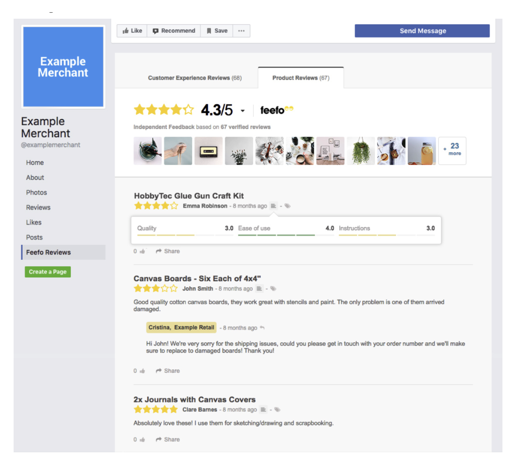

## Landscape
We looked at other kinds of rating services (Trustpilot / Feefo / Glassdoor), which allow businesses to implement widgets or embedded code to represent ratings for their industry. More often than not, these ratings are only displayed by businesses when they have a positive impact on their conversions.

The way in which these tools sell in their service, is a very positive one driven by uplift in sales, engagement and awareness. Because businesses are not likely to use them if they have low ratings, these services can focus their messaging on how beneficial it would be to use them. They do not communicate the negative aspects of bad ratings and how these may require additional resource from the businesses such as:
* Moderation
* Service changes
* Staffing changes
* Cost impact from time spent
* Community management on social media

### Businesses we looked at

**Trust pilot**

[Click here for widget system](https://uk.business.trustpilot.com/features/trustbox-widgets) 

Trustpilot has a unique platform which allows users to configure their own widgets to add to their websites. The key thing here, is that statistics show the businesses how much a Trustpilot widget can benefit their conversion rates. Key marketing features like SEO, AB testing etc allow the business to have some control over the placement and usefulness of the widget. It also provides tracking analytics of interaction with it as a selling point.

Sadly, you have to register to demo or tour the full set of features. Below is a snapshot of their offer and tools:

**Feefo**

[Click here for documentation](https://support.feefo.com/support/solutions/articles/8000041820-introduction-to-apis-apps-plugins-and-widgets)

Feefo offer **a lot** of support and guidance for anyone wanting to use their integrations. Their facebook tab integration is a useful example for this case however businesses must have 2000+ page followers to be able to add a custom widget of this kind (and only on Facebook). Interesting use of UIDs shown here also when retrieving reviews:

 

**Glassdoor**

Glassdoor follow a preference of 'ease of use' when it comes to placement; they specify _some|_ policy but it is light touch enough not to scare people off. 

_Widgets may be placed on your websites, blogs, your pages at online social network or media sites (to the extent permitted by such sites), and other similar platforms. Glassdoor prohibits the placement of Widgets on websites, platforms or devices that include content that is offensive, abusive, harassing, threatening, discriminatory, vulgar, pornographic, or otherwise inappropriate as determined by Glassdoor in its sole discretion. You must place each Widget in a context appropriate to the content of the Widget, and any reference to Glassdoor or its products and services must be accurate._

_You shall not modify any Widgets provided by Glassdoor. Without limitation, you shall not (i) change any code provided by Glassdoor; (ii) obscure or disable any element of the Widget; (iii) alter any links embedded within Glassdoor Widgets; (iv) tag links to Glassdoor from the Widget with a "nofollow" attribute; (v) redirect any links; (vi) otherwise prevent or discourage search engines from following or scoring any links; and (vii) insert any intermediate page, splash page or other content between Widget links and the applicable Glassdoor web page. You shall not cause, direct, allow, permit or authorize any modification of the Glassdoor Widgets, which includes separation into component parts or creation of derivative works._

[Their full policy is here](https://www.glassdoor.co.uk/about/widgetTerms.htm)

 

