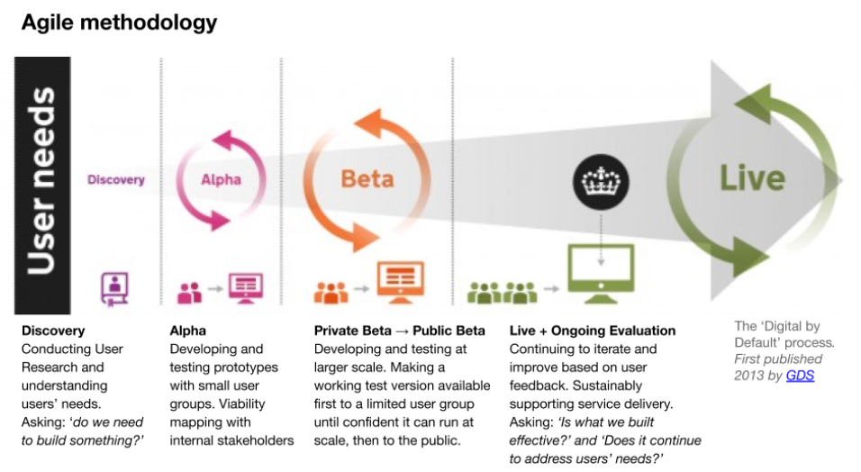
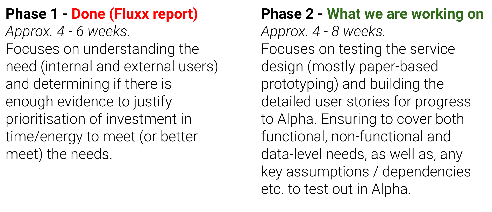

## GDS delivery methodology 

The FSA follows the GDS agile delivery phases. 

## FSA discovery methodology

The FSA further makes uses of a two part discovery methodology. This discovery covered part 2 due to previous work already undertaken by the FSA.

## Existing Research
The team were provided with a range of reports and outputs from the previous discovery project as well as other workstreams. These included:
* Fluxx Discovery report - This covered Business and Consumer research, personas, high level journeys, digital badge designs and user testing feedback.
* Fluxx User personas - consumer personas
* Fluxx User Journeys - consumers and small business owners
* Fluxx Rapid Landscaping - detailing the range of different applications and platforms businesses could use to build their websites. 
* Just Eat - ratings go digital user research report. This included findings from A/B testing, interviews and user testing covering user attitudes, understanding and response to digital badges, placement and design, both in qualitative feedback and impact on ordering.
*  TNS BMRB Research: Food Standards Agency - Understanding Northern Ireland consumer needs around Food Hygiene Rating Scheme (FHRS) information in online retail environments
FHRS Online Display in Wales Research report October 2019 - This report focused on consumer expectations and insights to inform placement of badges
* All previous design files
* API documentation

Having digested this information, the team focused on gaps and the objectives of this phase, to explore design, tech and implementation.

## Engagement

The discovery team engaged in insight sessions with many key stakeholder and users from the FSA, Food bodies and food businesses. Each insight session was in the form of 1 hour interviews. 

### The FSA
The discovery team engagement and held man research sessions with internal FSA staff or teams:  

1. Policy - England
2. Policy - Wales
3. Policy - Northern Ireland
4. Brand team
5. Comms team
6. IT 
7. Aggregators project
8. RAFB team
9. Online detection
10. AI enforcement

### Food businesses 

Including people we were unable to meet with in the time frame 

Number | Business | Role | Agreed to meet | Outcome
--- | --- | --- | --- | ---
1 | Casual Dining Group | Risk & Compliance Director | Yes | 1 hr meeting
2 | The Restaurant Group plc | Head of Technical and Safety | Yes | 1 hr meeting 
3 | Punch Pubs & Co| Head of Food | Yes | 1 hr meeting
4 | UK Hospitality | Chair of food experts group & Chairman FHR steering group | Yes | 1 hr meeting
5 | Zero2Five - Cardiff Metropolitan University | Research Fellow at Zero2Five | Yes | 1 hr meeting
6 | Uber Eats | Senior Associate, Public Policy & Restaurant Operations | Yes | 1 hr meeting
7 | Welsh Government | Head of Healthy and Active Branch | Yes | Unable to arrange time - remain interested
8 | Holiday Inn Express | General Manager | Yes | Unable to arrange time - remain interested
9 | Empire Hotel | Hotel Owner | Yes | Unable to arrange time - remain interested
10 | Just Eat | Head of Restaurant Management | Yes | Unable to arrange time - remain interested
11 | Nandos | Head of Safety and Quality Assurance | Yes | Unable to arrange time - remain interested
12 | Deliveroo | Director of Public Affairs | Initial response, no further progress | ---
13 | Rarebits | --- | No response | ---
14 | Holiday Inn | --- | No response | ---
15 | St Brides Spa Hotel | --- | No response | ---

## Surveys
Business - feedback, brand, onboarding, placement etc
Internal - brand

## Polling with Local Authorities

We attended and presented at local authority workshop during which undertook some polling. 

