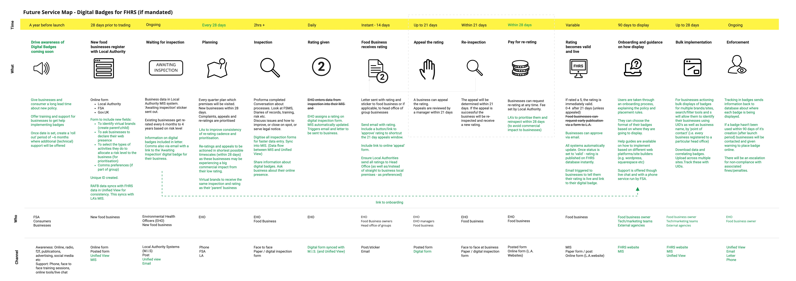

Below the Service Map shows a vision of a future state, where Digital Badges has been mandated and all recommendations have been put in place.

New elements of the service have been noted in GREEN with ongoing existing process still in black. As far as possible we have worked within existing policy and ways of working, to show how the new legislation would fit into the current service, rather than totally rethink it from the ground up. A phased implementation is advised, see the recommendations section of how we foresee this working. 

To see this in detail, either right click to open image in new tab or download the PDF here 
[Future Service Blueprint](uploads/Future_Service_Blueprint.pdf)

