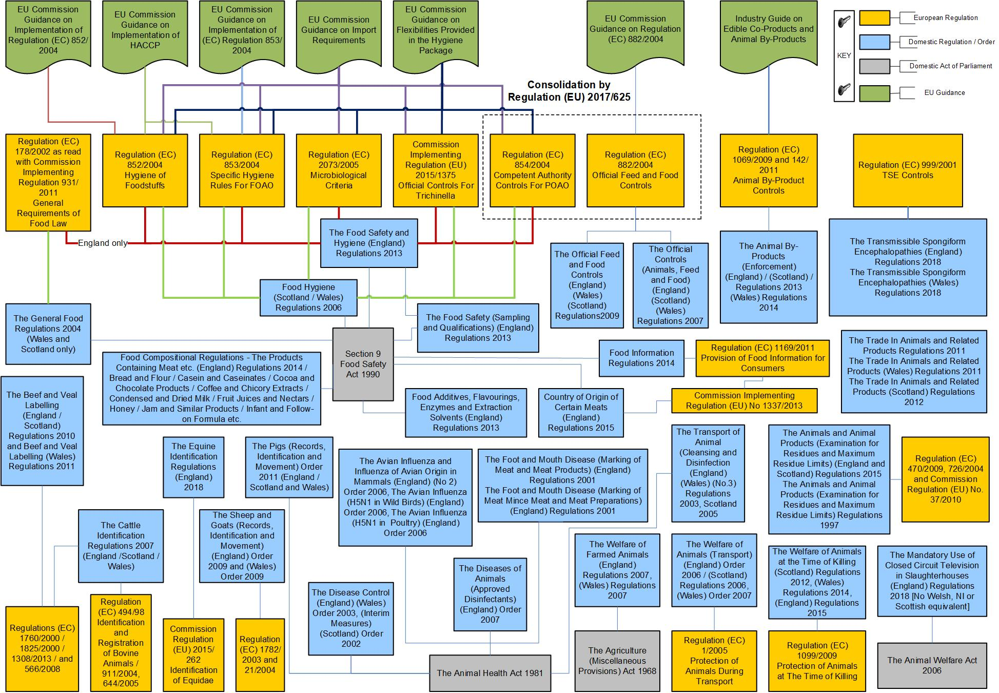

Most of food law is owned by the Policy teams within the FSA or other government departments (OGDs).

The Food Hygiene Rating Scheme scores are derived from the Food Law Code of Practices, these give instructions that local authorities must consider when enforcing food law. Local authorities need to follow and implement the relevant sections of the Code that apply.  

### England 
Food Law Code of Practice (England) is issued under section 40(1) of the Food Safety Act 19901 (the
Act), Regulation 26(1) of the Food Safety and Hygiene (England) Regulations 20132, and Regulation 6(1) of the Official Feed and Food Controls (England) Regulations 20093, which empower the Secretary of State to issue codes of practice concerning the execution and enforcement of that legislation by Competent Authorities. It relates to
England only.

Businesses in England do not have to display their rating at their premises but are encouraged to do so. 

### Northern Ireland 
Food Law Code of Practice (Northern Ireland) is issued under Article 39 of The Food Safety (Northern
Ireland) Order 19911 (the Order), regulation 22 of The Food Hygiene Regulations (Northern Ireland) 20062, and regulation 6 of The Official Feed and Food Controls Regulations (Northern Ireland) 20093, which empower the Department of Health, Social Services and Public Safety (DHSSPS) to issue codes of practice concerning
the execution and enforcement of that legislation by competent authorities. It relates
to Northern Ireland only. 

Businesses in Northern Ireland are legally required to display their ratings at or near each customer entrance like the front door, entrance or window of the business. Stickers must be displayed in a location where they can be readily seen and easily read by customers before they enter the establishment when it is open for business.

All businesses in Northern Ireland must provide information on their rating verbally if requested in person or over the phone.

### Wales
Food Law Code of Practice (Wales) is issued under section 40 (1) of the Food Safety
Act 1990 (the Act), regulation 24 of the Food Hygiene (Wales) Regulations 20061, and regulation 6 of the Official Feed and Food Controls (Wales) Regulations 20092, which empower the Welsh Ministers to issue codes of practice concerning the execution and enforcement of that legislation by Food Authorities. It relates to Wales only

Businesses in Wales are legally required to display their ratings in a prominent place, like the front door, entrance or window of the business. All businesses in Wales must provide information on their rating verbally if requested in person or over the phone.

The scheme applies to businesses who sell to businesses including food manufacturers and wholesalers. Takeaways must include a bilingual statement on menu leaflets and flyers which tells consumers how to find details of the rating on our website.

## Freedom of information 

Information collected as part of the food safety officer’s inspection report requested under [Freedom of Information Act 2000](http://www.legislation.gov.uk/ukpga/2000/36/contents). FOI requests are made to the local authority that carried out the inspection, and not the FSA. 

## FSA legislative landscape 

A full view of the legislation that governs the agency is shown in this graphic:

