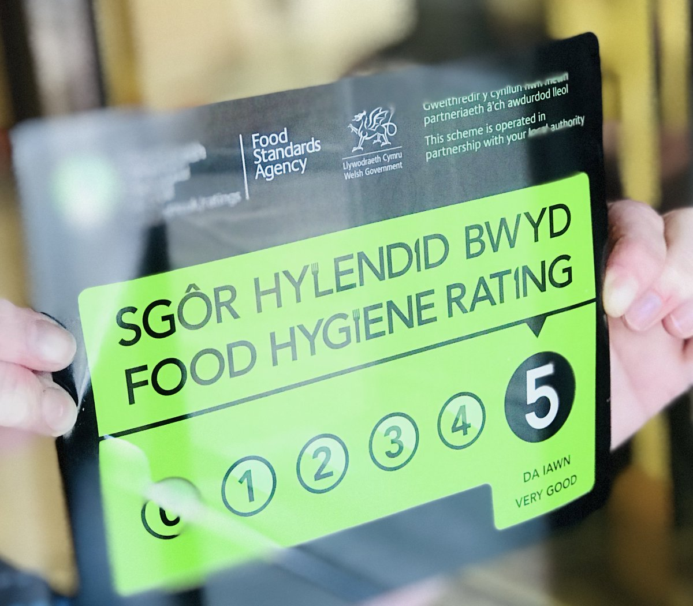

The scheme helps you choose where to eat out or shop for food by giving you clear information about the businesses’ hygiene standards. We run the scheme in partnership with local authorities in England, Wales and Northern Ireland.

Food Standards Scotland operates a similar scheme known as Food Hygiene Information Scheme (FHIS). 

The scheme gives businesses a rating from 5 to 0 which is displayed at their premises and online so you can make more informed choices about where to buy and eat food.

5 – hygiene standards are very good

4 – hygiene standards are good

3 – hygiene standards are generally satisfactory

2 – some improvement is necessary

1 – major improvement is necessary

0 – urgent improvement is required
 
The scheme is set out in law in Wales and Northern Ireland but display of the rating sticker is voluntary in England. 

Food Hygiene Rating Sticker with a rating of five

### What the rating covers

Ratings are a snapshot of the standards of food hygiene found at the time of inspection. It is the responsibility of the business to comply with food hygiene law at all times.

This includes:

- handling of food
- how food is stored
- how food is prepared
- cleanliness of facilities
- how food safety is managed

The food hygiene rating scheme does not provide information on the following factors:

- quality of the food  
- customer service  
- culinary skill  
- presentation  
- comfort

For suspected food poisoning, seek medical advice from your GP and contact your local environmental health or food safety team.

### Exemptions

There are two groups of exempt businesses which are inspected by the local authority food safety officer but are not given a food hygiene rating:

- businesses that are low-risk to public health, for example, newsagents, chemist shops or visitor centres selling pre-wrapped goods that do not require refrigeration 
- childminders and businesses that offer caring services at home

