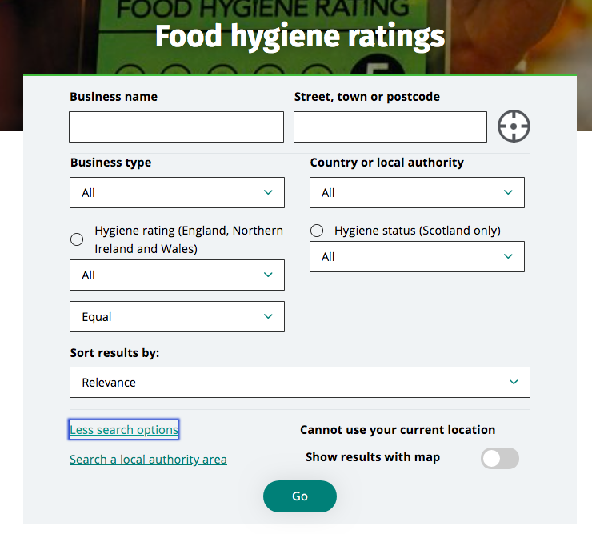
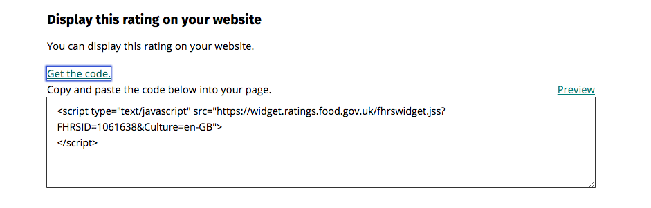
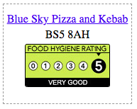
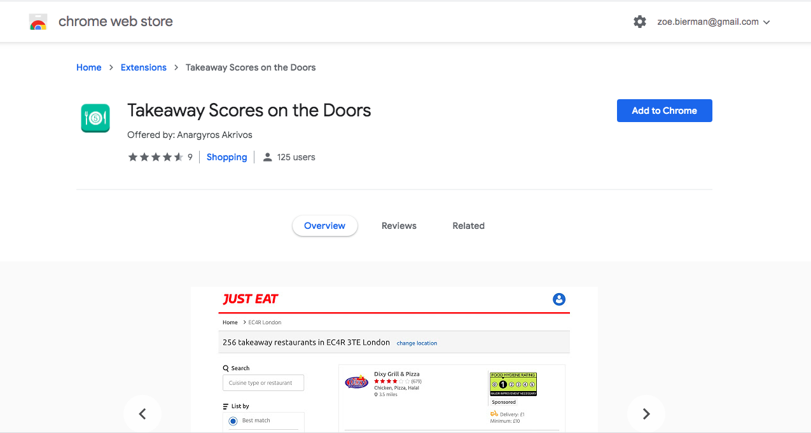

## Service overview 

The Food Hygiene Rating Scheme (FHRS) helps consumers in England, Wales and Northern Ireland choose where to eat out or shop for food by giving them clear information about the businesses’ hygiene standards.

FHRS inspections are conducted by Local Authorities (LAs), who determine their rating (0 - 5). The food businesses’ rating is then physically displayed to the public with a window sticker and the data is made publicly available here: ratings.food.gov.uk. The FHRS is set out in law in Wales and Northern Ireland but display of the rating sticker remains voluntary in England.

The service currently only includes the display of physical stickers, but both Wales and Northern Ireland are implementing mandatory display of digital badges. Consumers are presented with a food businesses’ hygiene rating when they make a food purchase online.

## Digital Badges
The FSA already provide a service which allows businesses to take a snippet of code and display it online. This API creates a link back to the relevant page on the FSA FHRS site.

The database can be searched and filtered:

Ratings viewed (including details of why they achieved that score):

Code snippets can be taken:

And an Digital Badge is generated which links back to the page:

This solution does give businesses the basic tools to implement displaying a digital badge. 

## Existing Services

We have also discovered a number of Google Chrome Add Ons which layer the data and images pulled from the FSA across aggregator sites:

* https://chrome.google.com/webstore/detail/takeaway-scores-on-the-do/cgfblelihkaeaeliedhajkmjllcehbdp?hl=en-GB
* https://chrome.google.com/webstore/detail/takeaway-hygiene-ratings/bkmnhmkibfcgcddfkgmgnecchilhbgmi?hl=en-GB
* https://chrome.google.com/webstore/detail/nomorvom/dlddncninpbgmlehociemoojbhhhnmph?hl=en-GB

## Tracking for enforcement
Tom Hartley informed the team of a four week project to build a prototype for online detection of FHRS ratings. They developed a couple of solutions: 
1. Semi automated: A web crawler which pulls out pictures but requires manual checking of rating (Questions over who would do this? - LA or FSA)
2. A fully automatic image recognition - refers back to FHRS database

Prototype is simple because of the simplified and consistent design of the FHRS image. THe original prototype used snapshot, but easy to make this to take from database. The issues with an image based search is that it is still possible for a business to steal another's image and use it on their website. There are also challenges with 'do not crawl' settings on websites blocking the tracker and it hasn't been tested on apps or social media.

