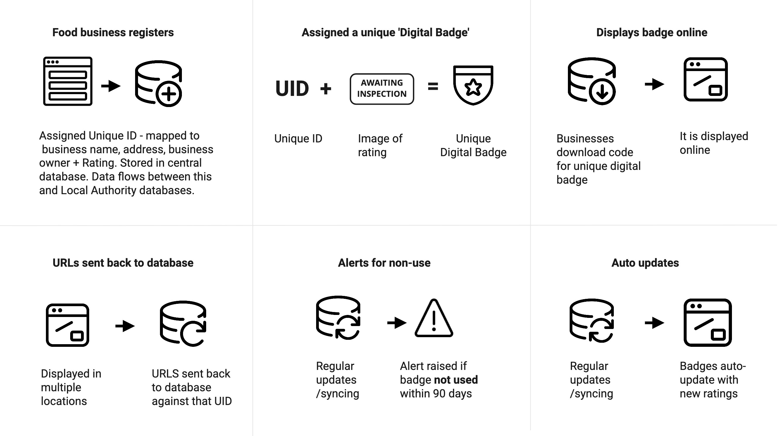

## Management

### New business registration
* Requirement of minimum data capture when registering a new food business to include current capture in addition to: 
  * Contact details for dedicated digital assets management role within business
  * Mobile number for SMS based 2 Factor Authentication
  * Backup email/phone number for 2 Factor Authentication
  * All online presence addresses
  * Capture of business type (eg Virtual Brand / Manufacturer)
  * Addition of a unique identifier field which correlates to referrer used in header - automatically assigned a numerical value from a centralised FSA managed database and added to business name (referrer) 
* Digital registration linked to Local Authority notification / MIS systems for data-flow reconciliation
* Missing or incomplete data alerts for follow up
* Use this information to create something more akin to an account or profile page which is open data and consumer visible - promote as an additional 'shop window' for businesses so they are motivated to maintain it inline with their digital presence 
* Potentially allow businesses to add more information to the page such as management or photography to drive engagement

### Legacy database migration and reconciliation
* Outreach and communications to businesses that they must add more information to their account
* Account generation for legacy entries (create password / add more info etc)
* Automated scanning of database to recognise outstanding legacy entries which do not reconcile against new framework
* Automated communications to businesses who fail to update information 
* Automated list export and notification of businesses who do not respond after a set period (90 days) for FSA to follow up with Local Authorities for face-to-face contact with such businesses to verify if still trading  

### Unique identifiers
* Unique identifiers (UIDs) being added to FSA database is key to tracking and managing the use of digital FHRS badges
* UIDs allow the FSA to add tracking code to badges and also allow tamper-proofing of the badges for businesses seeking to participate
* A simple numerical value being associated with a registered food business is recommended, potentially using a string such as a business serial number and a business 'type' code in addition to a location and authority code. For example:
  * A takeaway service as part of a chain operating in London could be as follows:
  * _Country code (01) + Business type code (09) + Local authority identifier (89) + Nandos single unit registration number (134)_
  * Which could resemble: **010989-134 / 010989134**
* These codes should be automatically generated by the database upon providing the correct and reconciled information needed at registration 
* Codes for local authority, location and business type should be set as part of the new database architecture
* Serial numbers for businesses should be assigned at registration, upon scanning the database for businesses of the same name and a human qualifying the association (eg a small business called 'Nando' is different to adding another premises of 'Nandos' the chain) 

## Asset delivery
* Creation of online guides for implementation, using video and interactive screen graphics
* Allow businesses to logon, to retrieve their digital assets (see below authentication)
* Supply a set of parent badge designs, with multiple options for implementation within each:
  * English / Welsh / Bilingual options
  * Design choices based on business preference
* Request format and size with basic, standard image URLs, with the server side interpreting and processing the request - for example, inspecting the requested file extension and returning the appropriate format
* Initially, server caching should likely be avoided and traffic monitored as uptake increases
* Once traffic levels, and therefore resource demand, can be observed and forecasted for ongoing use, this will inform the need for any additional server features and measures
* Recommended solution is to use a CDN to cache server requests for the badges, this is further enabled by a clean URL design 
* A serverless design would be the recommended architecture here:

**Service map for asset delivery:**

### Social media
* Social media platforms are app based (both web and device) and therefore do not allow the implementation of code for digital display of assets
* One simple solution here is to ask businesses to post a static assets of their badge which includes the business name, each time they accept a rating
* Facebook can provide businesses with 2000+ page followers the ability to implement a customised tab on the page. This tab can hold custom code and a badge could be shown here, however there is no guarantee a consumer will find this tab nor understand it's relevance 

## Governance

Retrieving assets could pose a risk for businesses looking to tamper with or steal highly rated badges for their own use. One way of dealing with this is to put business names into the badges as an option for use, however the badge sizes will increase and only some businesses would choose to use these (promote use over enforcement). Another way to deal with it is to provide the businesses an extra layer of security when requesting assets using 2 factor Authentication in combination with unique referrer headers shown on the front end and in the header of the site as tracking.

* There are many kinds of 2FA available, many third party integrations offer all of the below:
  * SMS/Voice one-time passcode (OTP)
  * Email one-time passcode (OTP)
  * API soft tokens 
  * Google Authenticator soft tokens

* A business will be asked to login and then further authenticate their badge retrieval by entering a one time passcode (OTP) or a token as described above
* The assets are delivered once the user has authenticated
* Once the badges are implemented into a website the consumer and business will be able to check the HTTP URL for a referrer which correlates to the business name and/or UID
* Headers are part of the HTTP specification, defining the metadata of the message in both the HTTP request and response. While the HTTP message body is often meant to be read by the user, metadata is processed exclusively by the web browser and has been included in HTTP protocol
* This metadata also allows the FSA to track where badges are appearing
* A web user can see text or numbers within the URL which relate directly to the badges they may be looking at online -  for example if 'Nandos Preston' becomes part of the URL but the badge is on a page for a different restaurant, the user will know there is something wrong
* API documentation will need to include instructions to set this header
* If necessary, analytics on collected data can be developed to identify any unusual behaviour - this could include geo-locating requester IP addresses, or monitoring for unusual traffic spikes 
*This could however be a significant undertaking and would need to be proportionate to identified risk of badges being misused

### Automation
* Alert local authorities when a new food businesses has been registered to FSA in their area
* Alert FSA when a food business has not displayed after 90 days of accepting rating
* Alert local authorities and automate prioritisation of new ratings, re-ratings or appeals
* Alert local authorities when businesses are overdue inspection
* Aggregate data on location, analysing if certain communities need help with digital display due to lack of resources or support (eg rural businesses over major cities) - map generated with hotspots for support or lack of participation
* Automated delivery of digital badges once rating accepted
* Automated UID generation on registering a new food business
* Allow FSA, local authorities and businesses to control alerts or communications in relation to their badges

