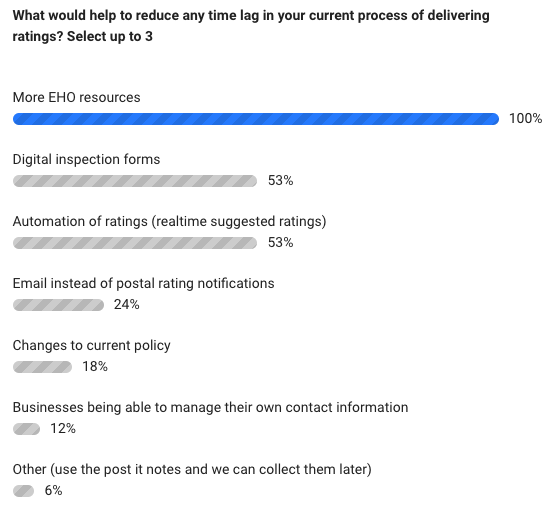
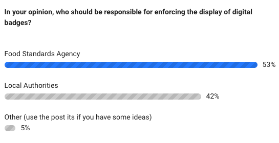
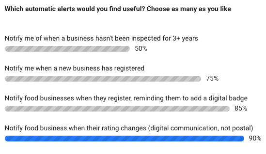

## Business needs
* For smaller owner/operators, managing websites isn't a priority. Skill levels are varied, therefore the process of displaying a digital badge needs to be simple and easy. 
* Clear guidance of how to implement and placement guidelines and examples so they can get it right
* Flexibility of badges to work in context of their brand and site design
* Support if things go wrong 
* Confidence that the ratings listed on FHRS is up to date (Just Eat check hourly, UberEats every 4 hours), correct and matched to the right business
* Data quality is high - consistency, governance
* Search and filter functionality of database is effective to allow bulk downloads of data and badges
* Fair warning before policy is introduced, so they know what is coming
* Consistency of experience with Local Authorities - examples include: timeliness of service, receiving all ratings at head offices for group businesses
* A clear understanding of who is going to enforce digital display and a line of communication for support

## Business Pain points
Businesses often follow lots of other guidelines and internal audits. For them FHRS is only one part of this, but will be the one that is visible
They may feel the rating is unfair as it is only a snapshot of the business on one day, and somewhat subjective to the inspector
Specific needs/pain points relating to operating model variance
### Owner/operator 
* Time lags in the ratings process can impact these businesses, especially if they rely on getting a 3 or over rating to be able to trade on aggregate sites
* May decide it is easier to have no online presence of their own than to manage this process and take down their own websites
### Chain 
* Quality across a brand needs to be consistently high - they want to drive up their ratings (a low rating can damage their whole brand)
* All types of larger businesses are spending time and money, building their own 'clean' databases to enable bulk operations (such as putting badges on each website)
### Group
* Placement across different websites would take a lot of design/build time. Most have different designs/layouts for each brand.
### Franchise/managed partnerships 
* Local Authority inconsistency means head office often don't receive ratings directly as they are sent to individual businesses (who may want to hide ratings from head office or equally may not want to have to deal with it) so it is hard to keep track of most up to date information.
### Leased/Tenanted 
### Aggregators 
* Competition for real estate on page is high, adding a big badge on search results page will be challenging to their brand and user experience.
* They are spending time and money, building their own 'clean' databases and doing up to hourly checks against FHRS to ensure they are up-to-date
* They have set a standard of 2/3 and above ratings - they don't want to punish businesses by taking them off the site due to errors or time delays made by local authorities
### Virtual brands 
* Don't want to receive multiple ratings for the different brands, when they are all based in the same place, with the same team and management. Recognition of this model - they should share a badge.
### Dark kitchens 
* Want flexibility to move and trade where/when demand is high - using different premises to prepare food. 'Place-based ratings don't work in this context'

***

## Customer needs
Previous research had focused on customers. We have summarised user needs and pain points below (from FLUXX discovery report, JustEat's FSA Ratings Go Online report and FHRS Online Display in Wales
Research report ) are:

### Needs
* Would like consistency of information available about ratings both online and in a physical environment - if it is mandatory offline it should also be so online
* Only want to order from 3 and above (would pass/fail be and easier distinction?)
* Need to understand where the rating has come from and it's 'quality' - The process and rating of food businesses is not clear or widely understood. Is it trustworthy? Does it meet my standard?
* Would like to be able to filter choices by FHRS rating
* Don't want to have to worry about hygiene with trusted brands/supermarkets
* Dual language/Welsh/English versions is important in Wales

### Pain points: 
* Context and awareness isn't high enough. Although the stickers are highly recognised, most customers were not clear on their meaning. Is a 3 good or bad? What is the score out of? 
* There are lots of factors and data available to consider when making decisions online (peer reviews, other rating systems, delivery time, dietary needs etc) with varying sources and quality - it can be hard to trust or put the right value on each of these
* The FSA logo can conjure up negative imagery when ordering food - making people think about dirty kitchens
* With the lack of visual cues or information on food hygiene or quality, people rely on user reviews and other visual information. Google street view also gets used at a way to determine the standard of the establishment
* Restaurants or food businesses that don’t display their food rating raise questions about their hygiene standards? What are you ashamed of?
* How can they trust that businesses are displaying the correct rating?

## Local Authorities - EHO's

We attended and presented at local authority workshop during which undertook some polling.

**Question 1**

**Question 2**

**Question 3**

